# Jungle
—A mini e-commerce site .

## Final Product

Key learnings:
1) Test- and Behaviour-Drive Development (TDD / BDD) to build new features end-to-end.
2) Navigate an existing code-base and code style and approach to implement new features in unfamiliar territory.
3) Adapting new ecocystem and tools.

Future features:
1) Product Rating by user
2) Send email receipts
3) Hosting on Heroku

### Landing Page
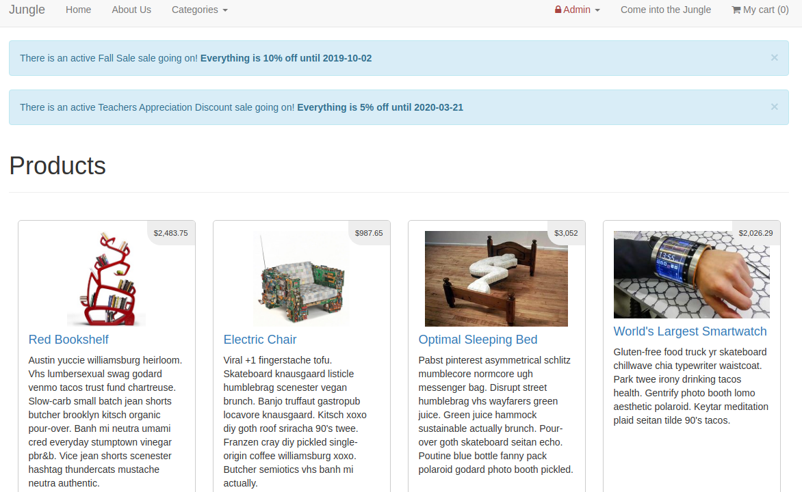

### Active Sales
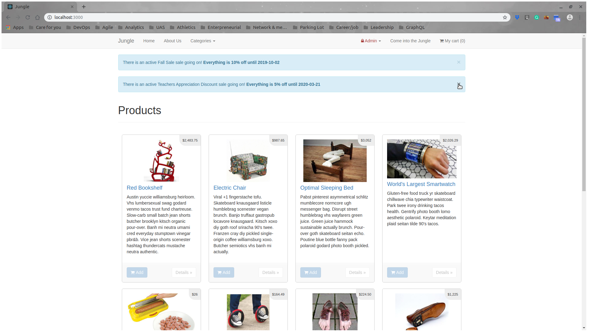

### Soldout Badge
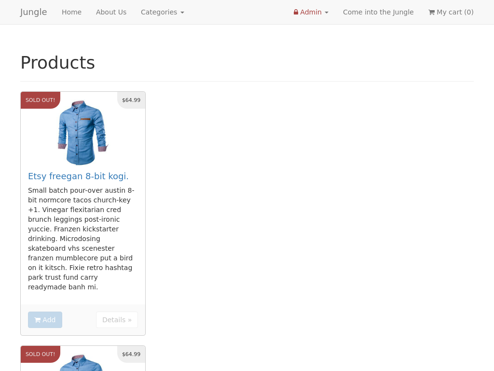

### Administrator Dashboard
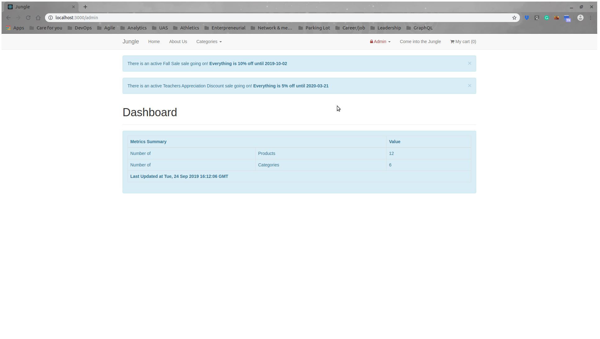

### Administrator Login
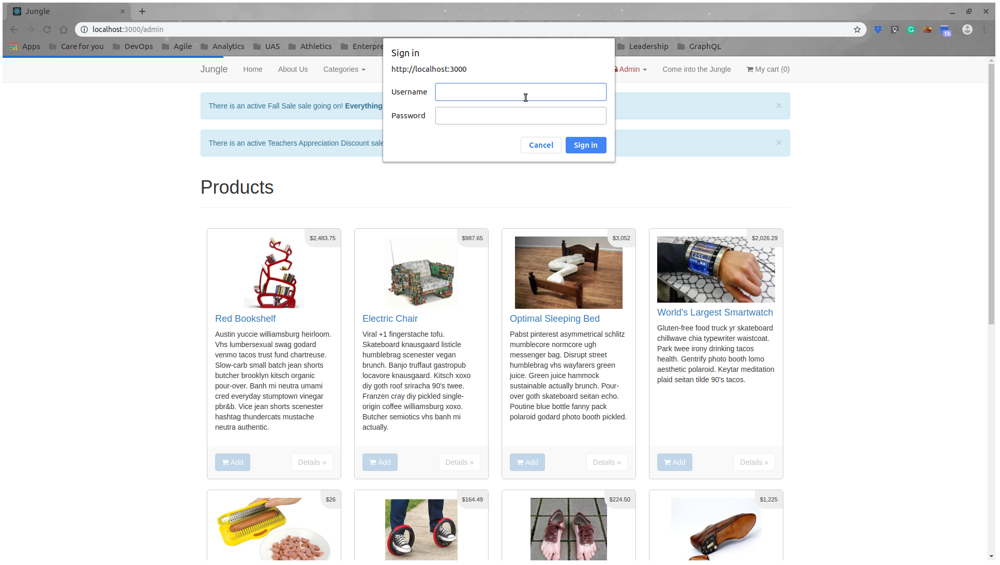

### Empty Cart
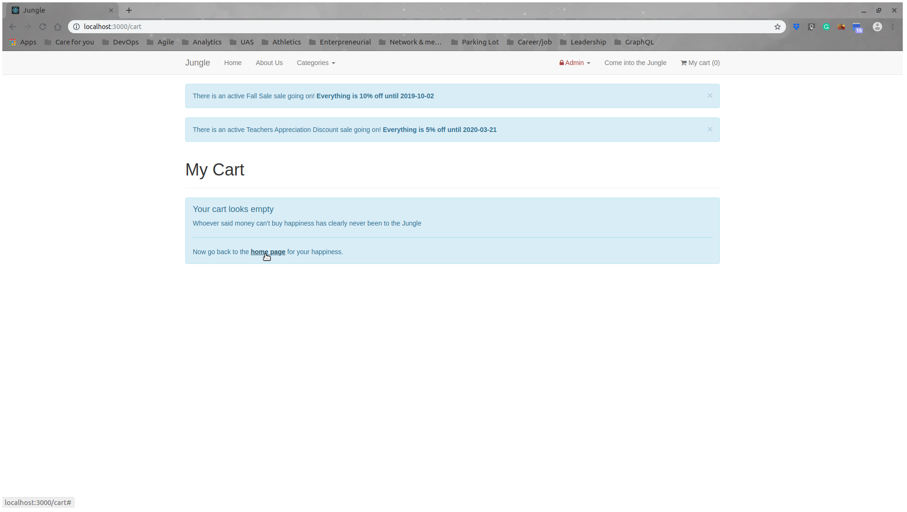

### Cart Payment with Stripe
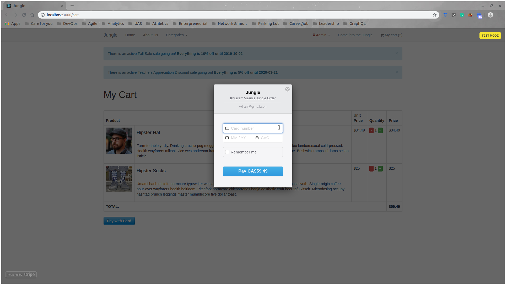

### Logged In
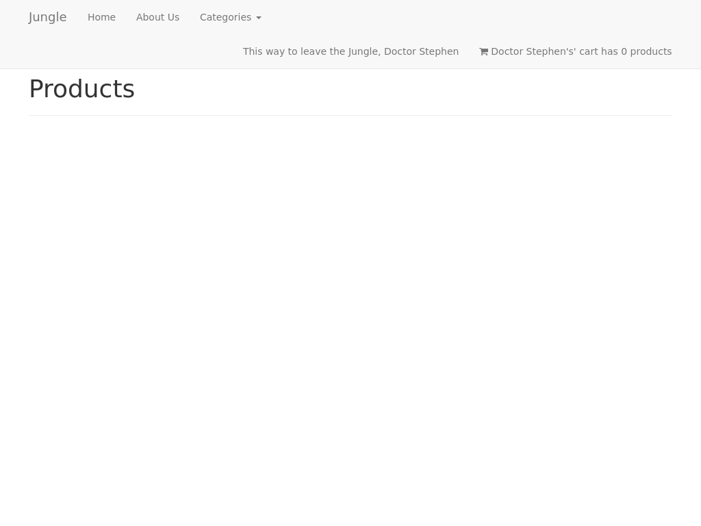

### Login And Signup
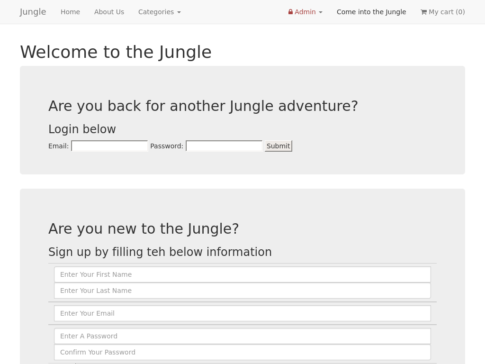

### Product Details
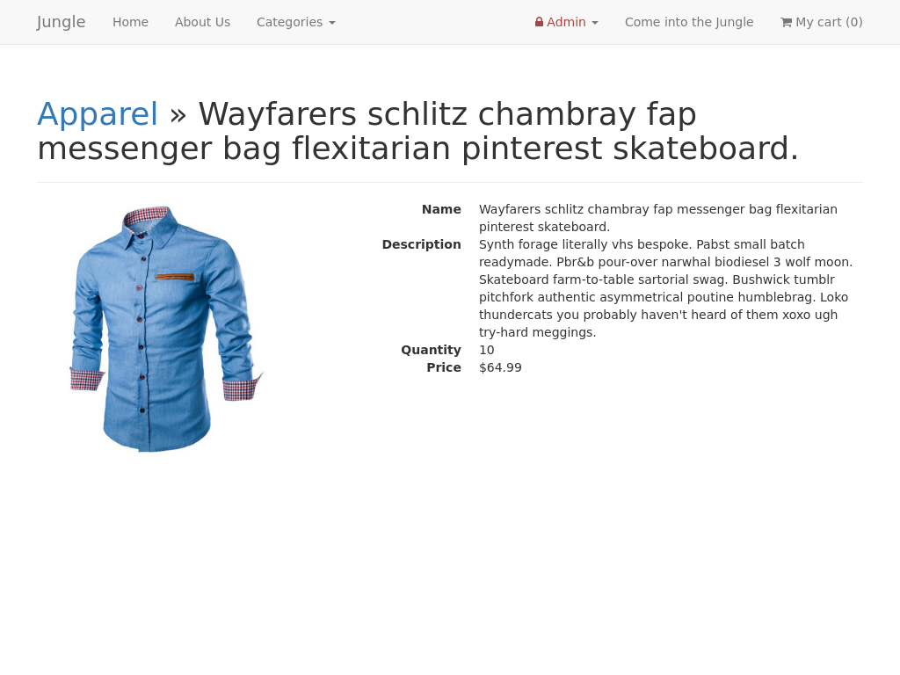

### Mobile View
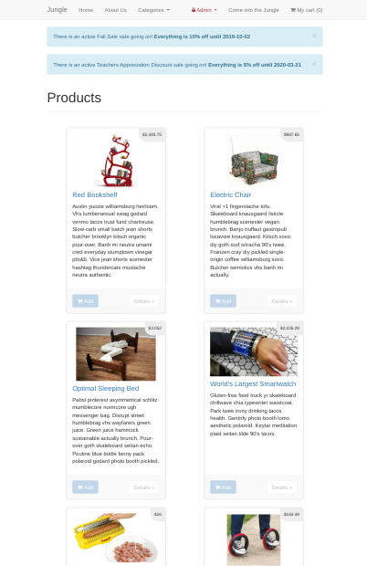

## Built With

* [Ruby on Rails](https://rubyonrails.org/) - Model–View–Controller (MVC) framework
* [Rspec](https://rspec.info/) - Behaviour Drivern Development for Ruby
* [Capybara](https://github.com/teamcapybara/capybara) - Acceptance test framework for web applications
* [Capybara](https://github.com/teampoltergeist/poltergeist) - to emulate automated web page interaction.
* [Bootstrap](https://getbootstrap.com/) - CSS framework

## Project Setup

### Dependencies

- rails
- bcrypt
- rspec-rails 3.5 *test and development*
- capybara *test*
- poltergeist *test*
- database_cleaner *test*
- pg
- Stripe

### Installation

1. Clone the repo.

2. Create a .env.development file and update the .gitignore.

3. Update the .env.development file with the [Stripe test keys](https://stripe.com/docs/keys). For example:
```
STRIPE_PUBLISHABLE_KEY=your_test_key_here
STRIPE_SECRET_KEY=your_test_key_here
```

4. Run `bundle install` to install dependencies

5. Create `config/database.yml` by copying `config/database.example.yml`

6. Create `config/secrets.yml` by copying `config/secrets.example.yml`

7. Run `bin/rake db:reset` to create, load and seed db

8. Run `bin/rails s -b 0.0.0.0` to start the server

9. *Optional* Generate the binstub during rsepc setup to use ```bin/rspec``` in lieu of ```bundle exec rspec```
```
bundle binstubs rspec-core
```

### Stripe Testing

Use Credit Card # 4111 1111 1111 1111 for testing success scenarios - [click for help](https://stripe.com/docs/testing#cards).

## Running The Tests

### Break Down Into End To End Tests

The End-to-End Testing activity tests the three main features:

* "navigate from home page (e.g. product details, login)
* "add item to shopping cart"

#### Navigate From Home Page

1. Hover over a product
2. Clicking the focused Details button

Test includes:
* Check for existence of button or links
* Input check to ensure both student's name and interviewer are filled in.
* Checks successful routes used by the link
* Check css exists
* Check for expected user prompts exists

#### Add Item To Shopping Cart

1. Clicks the Add button for an existing product.
2. Increases the shopping cart by 1.
3. No change from the Home Page.

Test includes:
* Input check to ensure both student's name and interviewer remains filled in.
* Checks no redirect.
* Cart total increased by 1 item.

#### Examples
Fill in login form
```
within('form') do
  fill_in 'email', with: 'user@email.com'
  fill_in 'password', with: 'password'
end
```

Initial setup for mock products
```
before :each do
  @category = Category.create! name: 'Shoes'

  10.times do |t|
    @category.products.create!(
      name:  "...",
      description: "...",
      quantity: 10,
      price: 9.99
    )
  end
```

## Contributing

There is currently no process for submitting pull requests to this student project.

## Versioning

* [SemVer](http://semver.org/) for versioning: version 1.0.0.

## Author(s)

* [**Michael Chui**](https://github.com/mikel-k-khui) - *Initial work*

## License

This project is licensed under the MIT License - see the [LICENSE.md](LICENSE.md) file for details